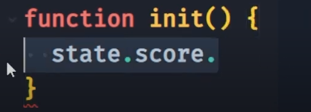
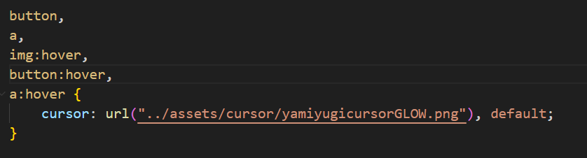

video Criando os states da engine 

async function createCardImage(IdCard, fieldSide) {
    const cardImage = document.createElement("img");
    cardImage.setAttribute("height", "100px");
    cardImage.setAttribute("src", "./src/assets/icons/card-back.png");
    cardImage.setAttribute("data-id", IdCard);
    cardImage.classList.add("card");

    if(fieldSide === playerSides.player1) {
        cardImage.addEventListener("click", () => {
            setCardsField(cardImage.getAttribute("data-id"))
        })
    }

    cardImage.addEventListener("mouseover", () => { [Explicar que essa parte ficar dentor do if pra gira somente as cartas do jagador 1]
        drawSelectCard(IdCard)
    });

    return cardImage;
}

Fala sobre:
